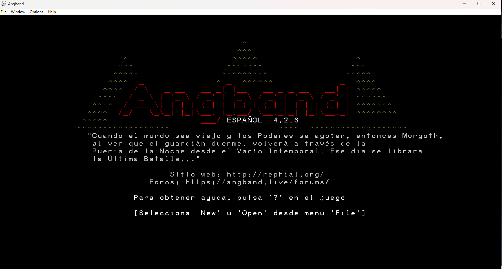
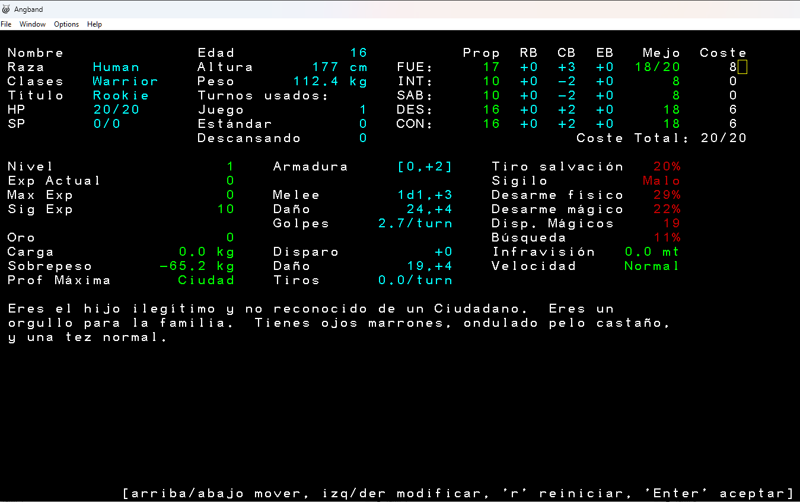
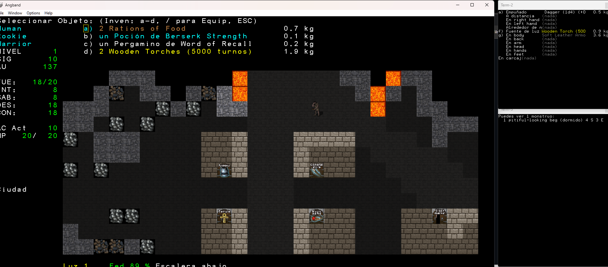

# Angband 4.2.6 en Español

## Autor
Hernaldo González  - hernaldog@gmail.com

# Status general de la traducción
50%

## Bitácora principal
- 21-02-2026 - Se entiende como compilar en Windows 11 y hacen pruebas de concepto.
- 21-02-2026 - Se inicia traducción de primeros elementos como news.txt o archivos c/h base.
- 20-03-2026 - Se entiende y empieza a traducir archivos txt dentro de gamedata, .rst y archivos de tiles .prf

## Motivación
Me entantan los juegos Roguelike clásicos como Moria, Rogue, etc, a la vez, siempre me ha gustado el Señor de los Anillos, y que mejor que este gran juego que uno los dos mundos. 
Lo he jugado un par de veces solo en inglés y siempre he pensado que más gente de habla hispana lo jugaría si estaría en Español. 
Como fui traductor de ROMS de la vieja escena de SNES o NES por los años 2000 en "RomHack Hispanio.org", 
tengo algo de experiencia en traducciones y quise aplicar lo aprendido allí. Espero terminar lo empezado, no es una tarea fácil.

## Objetivo del juego
Por si no lo sabías, como este juego es una "rama" del juego [UMoria](https://umoria.org), donde hay que bajar al nivel 50 de profunidad a derrotar al Balrog. 
En este case, hay las cosas se ponen mejor aún, y hay que bajar al nivel 100 y derrotar nada más y nada menos que a **Morgoth**. Link de [Wikipedia](https://es.wikipedia.org/wiki/Angband_(videojuego)).

## Sitio base y Git de Angband
- https://github.com/angband/angband
- https://rephial.org Sitio con último release y código fuente para Windows, Linux y Mac
- https://angband.readthedocs.io/en/latest/index.html Manual

## Licencia
Se mantienen las mismas dos licencias originales:

- Licencia GNU GPL v2
- Licencia Angand

## Capturas
Algunas capturas del estado actual de la traducción:

## Pasos para la compilación si quieres colaborar

Lo primero es comunicarte conmigo al correo indicado más arriba para coordinar acciones.

Bajar **MSYS2**  https://www.msys2.org/
Instalarlo sin nada particular, todo Siguiente, Siguiente.

En Windows 11, entrar al acceso directo creado **MSYS2 MINGW64**, es un icono con una M blanca sobre un fondo azul.

### Comandos

Este primero, demora como 5 min

    pacman -S make mingw-w64-x86_64-gcc mingw-w64-x86_64-cmake mingw-w64-x86_64-ninja

Luego:

    pacman -S mingw-w64-x86_64-libpng
    pacman -S mingw-w64-x86_64-ncurses

Después:

    pacman -S mingw-w64-x86_64-SDL2 mingw-w64-x86_64-SDL2_image \
        mingw-w64-x86_64-SDL2_ttf mingw-w64-x86_64-SDL2_mixer

Ir a carpeta **src** dentro del fuente

    cd c:\juegos\Angbandsrc\src

Compilar para Windows Native:

    cmake -G Ninja -DSUPPORT_WINDOWS_FRONTEND=ON \
        -DSUPPORT_STATIC_LINKING=ON \
        ..
    ninja

Si funciona bien dirá esto:

    naldo@shachalaloca MINGW64 /c/juegos/angband-esp/src
    $ cmake -G Ninja -DSUPPORT_WINDOWS_FRONTEND=ON \
        -DSUPPORT_STATIC_LINKING=ON \
        ..
    ninja
    -- Could NOT find Sphinx (missing: SPHINX_EXECUTABLE)
    CMake Warning at CMakeLists.txt:100 (message):
      Disabling SDL2 front end because Windows front end is enabled
    
    
    CMake Warning at CMakeLists.txt:124 (message):
      Disabling SDL2 sound because Windows front end is enabled
    
    
    -- Using system PNG and ZLIB (static)
    --   PNG static libraries    : png16;m;z
    --   PNG static include dirs : C:/msys64/mingw64/include/libpng16;C:/msys64/mingw64/include
    -- Configuring done (0.4s)
    -- Generating done (4.4s)
    -- Build files have been written to: C:/juegos/angband-esp/src
    [216/216] Linking C executable game\angband.exe

Salida del ejecutable en carpeta src/game:
C:\juegos\Angbandsrc\src\game

ahí estará: angband.exe

Instrucción original en Inglés: https://angband.readthedocs.io/en/latest/hacking/compiling.html#using-msys2-with-mingw64

## Probando exe
Descarga el binario (no el código fuente) para Windows Angband-4.2.6 desde https://rephial.org donde dice "Download". 

Descomprimir en C:\Angband-4.2.6

Para probarlo, copia ese **angband.exe** que generaste recién de la compilación de 

    C:\juegos\Angbandsrc\src\game

y pégalo sobre la carpeta donde desomprimiste el ZIP original

    C:\Angband-4.2.6

Así toma las librerías .dll correctas.

## Traduciendo TXT

Hay archivos txt que se pueden traducir de forma directa sin tener que compilar como \lib\screens\news.txt. Esto hace más simple la traducción.

## Traduciendo archivos .c

Una vez traducidos, antes de compilar hay que eliminar la carpeta /src/game generada en una compilación anterior. De lo contrario, no se ve reflejado el cambio.

## Archivo shell script compila.sh

Usa este archivo SH para compilar más facilmente ya que elimina carpeta temporal, compila y además copia el ejecutable a la carpeta del juego original para probar más facilmente. Este archivo quedó subido a GIT.

Para correrlo debes copiar el archivo que está en el fuernte

luego dejarlo en tu ruta local: 

    C:\msys64\home\<tu usuario>

Luego entrar al acceso directo de Windows **MSYS2 MINGW64** (no es necesairo abrirlo como administrador), y adentro solo ejecutar el comando:

    .\compila.sh

Contenido del script shell:

    cd c:
    cd c:/juegos/angband-src-esp/src
    
    echo "Eliminando carpeta game"
    rm -rf game
    
    echo "Eliminando carpeta CMakeFiles"
    rm -rf CMakeFiles
    
    echo "Compilando..."
    cmake -G Ninja -DSUPPORT_WINDOWS_FRONTEND=ON \
        -DSUPPORT_STATIC_LINKING=ON \
        ..
    ninja
    
    echo "Compilacion terminada..."
    
    echo "Abriendo juego C:/juegos/angband-src-esp/src/game/angband.exe"
    
    C:/juegos/angband-src-esp/src/game/angband.exe

## Gamedata y txt

Al momento de traducir, hay muchos archivos txt en una carpeta llamada "gamedata". La que tiene el código fuente es esta ruta de la raiz:

    1. fuente\lib\gamedata

y no esta:

    2. fuente\src\game\lib\gamedata

Al momento de compilar se traspasa de forma automática del lugar 1 al lugar 2. Así que no debes traducir desde el lugar 2 directamente.

**NOTA:** La forma de leer estos txt, como object.txt, se hace por medio de un archivo llamado obj-init.c y un sistema de "parser". Los campos como "name" tienen un index que si cambias los valores por ejemplo, "Apple"
y dejas "Manzana" ese index cambia, y si luego cargas una salvada de partida vieja, se rompe el juego. Por lo tanto, en esta traducción, las salvadas no serán compatible con otras versiones del juego en inglés.

- Cuidado con los textos "anidados": Al cambiar el "name" de un item en object.txt, ejemplo "Wooden Torch" port "Antorcha de Madera", debes colocar el mismo nombre en class.txt -> ego_item.txt -> store.txt y en los archivos de tiles "lib\tiles\shockbolt\graf-shb-dark.prf"
- El plural va con el símbolo ~ ejemplo: Antorcha~ de Madera y solo en el archivo object.txt

## Encoding
Todos los archivo deben traducirse usando encoding **UTF-8**.

## Pendientes de traducción
- Cambios de imágenes gráficas General Store, Armory, Magic Items, Black Market, Temple.
- Cambios en tabulaciones o largos de frase que se ven mal visualmente como "Selecciona Nuevo" se ve muy a la derecha
- Cambios de unidades a Sistema métrico decimal:
  - menú superior derecho lb a kg -> ok
  - peso de listado de items menú superior de lb a kg -> ok
  - lista de items al usar i inventario, w usar o d drop de lb a kg -> ok
  - nuevo personaje unidades peso de st lb a kg -> ok
  - nuevo personaje carga y sobrepeso de lb a kg -> ok
  - nuevo personaje altura de pies y pulgadas a cms -> ok
  - nuevo personaje de ft a mt (infravisión) -> ok
  - tiendas de ciudad pesos de items de lb a kg -> ok
  
- Mejoras en traducciones varias:
  
  - Has encontrado 18 piezas de oro en gold, buscar mejor traducción
  - enemigo bites you, enemigo misses you, etc
  - No se pueden traducir nombres de monstruos (monster.txt) si se hace indica error al cargar partida
  - En el lore de las criaturas como "Ello tiene una media valoración" o "No se sabe nada de su ataque de su"
  - Has detectado X objetos: 6 Light Teal Pocións. Acá o inglés o español y la s está rara. Archivo "obj-desc.c"
  - The flotating eye se despiertan. Y es uno solo. Está demás la "n"
  - Mejorar: The fruit bat (offscreen) se despertan.
  - Mejorar: "Ves un fruit bat (unhurt, hasted)
  - Mejorar: "Puedes aprender 2 rituals más."
  - Mejorar lista de items: un Apple
  - Mejorar: "You have 7 Rations of Food (a).": ok
  - Con tecla d "Soltar qué objeto", por "¿Qué objeto soltar?": ok
  - You drop, debe decir "Soltaste x objeto": ok
  - The cutpurse ¡huye aterrorizados!. Dice con "s" y es uno solo: ok se dejó sin s fijo por ahora
  - Mejorar: "Puedes ver ningún monstuo": ok
  - Tecla S "Race and class abilities": ok
  - Tecla V información de licencia: ok
  - Mejorar "Puedes ver ningún objeto": ok
  - Mejorar "Este parece ser un lugar manso y resguardado: ok

## Detalle de la traducción por archivo

| Archivo                                  | % Avance | TODO                                                 |
| -----------------------------------------| ------   | -----------------------------------------------------|
| docs\attack.rst                          | 100      |
| docs\command.rst                         | 100      |
| docs\customize.rst                       | 100      |
| docs\hacking\modifying.rst               | 100      |
| lib\gamedata\player_property.txt         | 100      |
| lib\gamedata\history.txt                 | 100      |
| lib\gamedata\hints.txt                   | 100      |
| lib\gamedata\player_timed.txt            | 70       | No traducir :Hungry: afecta a new game, hay que revisar todo el texto|
| lib\gamedata\object.txt                  | 90       | Faltan traducir textos name|
| lib\gamedata\ego_item.txt                | 100      |
| lib\gamedata\object_base.txt             | 100      |
| lib\gamedata\object_property.txt         | 100      |
| lib\gamedata\monster_spell.txt           | 100      |
| lib\gamedata\monster.txt                 | 100      | Revisar textos se pueden mejorar|
| lib\gamedata\blow_methods.txt            | 100      |
| lib\gamedata\class.txt                   | 100      |
| lib\gamedata\terrain.txt                 | 100      |
| lib\help\commands.txt                    | 100      |
| lib\help\index.txt                       | 100      |
| lib\help\r_index.txt                     | 100      |
| lib\help\symbols.txt                     | 100      |
| lib\screens\news.txt                     | 100      |
| src\borg\borg.txt                        | 100      |
| src\borg\borg-item.c                     | 100      |
| src\main-win.c                           | 100      |
| src\init.h                               | 100      |
| src\borg\borg-messages.c                 | 100      |
| src\mon-util.c                           | 100      |
| src\cmd-cave.c                           | 100      |
| src\borg\borg-item-val.c                 | 100      |
| src\ui-mon-list.c                        | 100      | Corregir traducción "Puedes ver ningún monstruo".|
| src\ui-knowledge.c                       | 100      |
| src\ui-game.c                            | 100      |
| src\ui-score.c                           | 100      |
| src\ui-event.h                           | 100      |
| src\list-equip-slots.h                   | 100      |
| src\obj-desc.c                           | 100      |
| src\ui-obj-list.c                        | 100      |
| src\ui-birth.c                           | 100      |
| src\ui-help                              | 100      |
| src\cmd-obj.c                            | 100      |
| src\ui-object.c                          | 100      | Peso de inventario menú superior derecho, comando i y comando w|
| src\ui-input.c                           | 100      |
| src\player-attack.c                      | 100      |
| src\player-util.c                        | 100      |
| src\ui-command.c                         | 100      |
| src\ui-player.c                          | 100      | Nuevo personaje: unidades al español de peso, altura, carga, sobrepeso, distancia de infravisión|
| src\list-options.h                       | 100      |
| src\ui-options.c                         | 100      |
| src\ui-display.c                         | 100      |
| src\ui-context.c                         | 100      | 
| src\mon-lore.c                           | 100      | Corregir frases varias |
| src\player-calcs.c                       | 100      |
| src\player-spell.c                       | 100      |
| src\ui-spell.c                           | 100      | Corregir "Estudiar qué libro?"|
| src\score.c                              | 100      |
| src\ui-target.c                          | 100      |
| src\cmd-pickup.c                         | 100      |
| src\ui-death.c                           | 100      |
| src\player.c                             | 100      |
| src\mon-move.c                           | 100      |
| src\mon-desc.c                           | 100      |
| src\list-mon-message.h                   | 100      |
| src\ui-store.c                           | 100      |
| src\cave.c                               | 100      |
| src\list-origins.h                       | 100      |
| src\obj-info.c                           | 100      |
| src\effects-info.c                       | 100      |
| src\list-effects.h                       | 100      |
| src\ui-output.c                          | 100      |
| src\buildid.c                            | 100      |
| src\ui-player-properties.c               | 100      |
| src\list-mon-race-flags.h                | 100      |
| src\obj-gear.c                           | 100      |
| src\mon-attack.c                         | 100      |
| src\mon-init.c                           | 100      |
| src\mon-blows.h                          | 100      |
| src\mon-blows.c                          | 100      |
| src\obj-tval.c                           | 100      |
| src\object.h                             | 100      |
| src\obj-desc.h                           | 100      |
| src\obj-tval.h                           | 100      |
| src\obj-list.c                           | 100      |
| src\obj-util.c                           | 100      |
| src\obj-init.h                           | 100      |
| src\obj-init.c                           | 100      |
| src\obj-chest.c                          | 100      |
| src\obj-power.c                          | 100      |
| src\player.h                             | 100      |
| src\store.c                              | 100      |