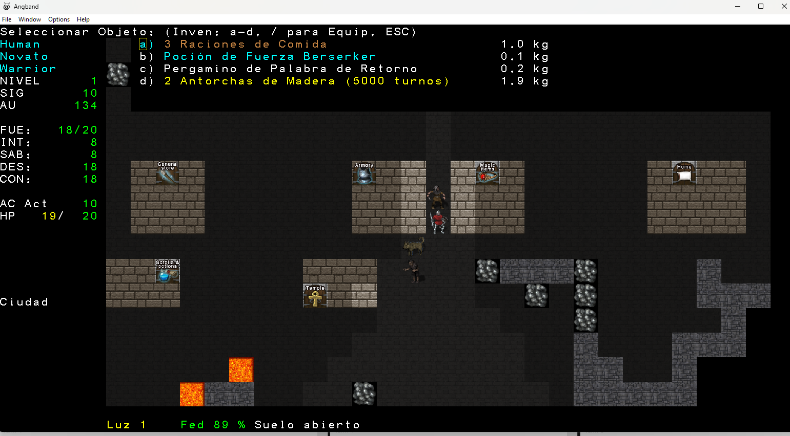
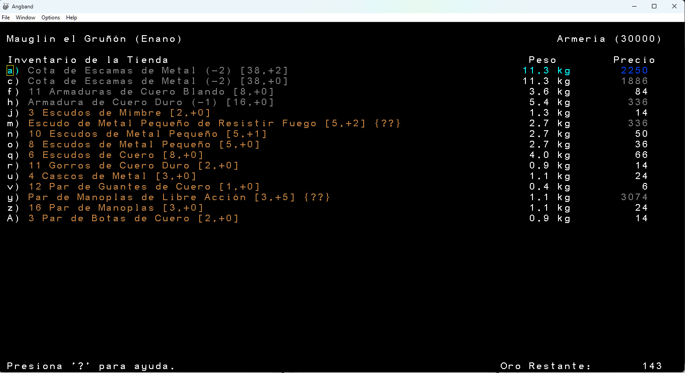

# Angband 4.2.6 en Español

## Autor
Hernaldo González  - hernaldog@gmail.com

# Status general de la traducción
98%

## Bitácora principal
- 21-02-2026: Se entiende como compilar en Windows 11 y hacen pruebas de concepto.
- 21-02-2026: Se inicia traducción de primeros elementos como news.txt o archivos c/h base.
- 20-03-2026: Se entiende y empieza a traducir archivos txt dentro de gamedata, .rst y archivos de tiles .prf
- 23-03-2026: Para facilitar la traducción al español. Se cambian todos los prefijos en objetos, ejemplo "Un Pergamino", "Una Manzana" y solo deja la unidad + objeto, ejemplo "Ves 1 Antorcha de Madera", "Te quedan 3 Linternas". Esta idea sale de otros juegos Roguelike como Shattered Pixel Dungeons donde no hay prefijos en objetos.
- 27-03-2026: Se logra editar los txt, se agrega tag nuevo en object.txt llamado "name_plural" y archivos c como obj-init.c, object.h, obj-desc.c, z-textblock.c para manejar objetos en Español que usan plural y que son muy diferentes al inglés, como "Ración-> Raciones" o "Perdigón -> Perdigones".
- 28-03-2026: Se logra ampliar el método que imprime caracteres a color de ASCII a UTF-8 en effects-info.c, método copy_to_textblock_with_coloring(), esto para las tildes de lenguaje español cuando se inspecciona un objeto.
- 02-04-2026: Se traduce la mayoría de los nombres de monstruos al español, esto en archivos monster.txt, monster_base.txt, pit.txt, summon.txt, borg-flow-kill.c. Faltan algunos que están relacionados a otros txt
- 17-04-2026: Se traducen todos los objetos
- 13-06-2026: Razas, Clases, Versos del Druida, ajustes generales para mejorar semántica
- 25-06-2006: Se agrega género a los objetos para mejor traducción: Ves una Poción, Ves una Galleta, etc. Se traducen opciones de modo mago.
- 09-07-2026: Se crea un sistema multi-idioma que soporta por ahora Inglés y Español. Permite en un futuro traducir a más idiomas. Se agregan dos lenguajes Inglés y Español desde el Menú Principal de Windows. 
Por abajo se crea un archivo lib/locale/es.po que tiene el diccionario de strings de la interfaz (src/*.c, *.h) para español. Si en un futuro se quiere traducir a portuguez solo hay que crear locale/pt.po
Se usa un sistema "lang_current" para temas que el diccionario simple no puede resolver. Para los .txt de objetos, monstruos, terrenos, etc se usan carpetas separadas 
lib/gamedata/en/*.txt y lib/gamedata/es/*.txt. Falta solo probar y probar en ambos idioma inglés y español.

## Motivación
Me entantan los juegos Roguelike clásicos como Moria, Rogue, etc, a la vez, siempre me ha gustado el Señor de los Anillos, y que mejor que este gran juego que uno los dos mundos. 
Lo he jugado un par de veces solo en inglés y siempre he pensado que más gente de habla hispana lo jugaría si estaría en Español. 
Como fui traductor de ROMS de la vieja escena de SNES o NES por los años 2000 en "RomHack Hispanio.org", 
tengo algo de experiencia en traducciones y quise aplicar lo aprendido allí. Espero terminar lo empezado, no es una tarea fácil.

## Objetivo del juego
Por si no lo sabías, como este juego es una "rama" del juego [UMoria](https://umoria.org), donde hay que bajar al nivel 50 de profunidad a derrotar al Balrog. 
En este case, hay las cosas se ponen mejor aún, y hay que bajar al nivel 100 y derrotar nada más y nada menos que a **Morgoth**. Link de [Wikipedia](https://es.wikipedia.org/wiki/Angband_(videojuego)).

## Enlaces
- https://github.com/angband/angband GitHub Oficial
- https://rephial.org Sitio con último release y código fuente para Windows, Linux y Mac
- https://angband.readthedocs.io/en/latest/index.html Manual oficial en inglés
- https://angband.live/forums/forum/angband/development/257970-angband-4-2-6-in-spanish Hilo en los foros oficiales donde puedes opinar y apoyar esta iniciativa

## Licencia
Se mantienen las mismas dos licencias originales:

- Licencia GNU GPL v2
- Licencia Angand

## Capturas
Algunas capturas del estado actual de la traducción:

## Testing

### Modo Mago
El juego por si solo tiene un modo símple de testear las traducciones. Puedes usar el modo mago, que no registra el puntaje.

- Control + w para entrar a modo mago (no se puntua)
- Control + a para activar comandos
  - c: selecciona el objeto que quieras que aparezca bajo tus pies, saldrá un menú
  - s: hace aparecer uno o más monstruos aleatorios cercanos. Te preguntará por la cantidad.
  - n: hace aparecer un monstruo cercano. Puedes escribir el nombre del monstruo (ej: naga negro) o un número con el ID del monstruo
  - a: curarte
  - j: teletransportarse a un nivel. Puedes escribir el nombre de perfil: classic, lair, town, moria, cavern y otros
  - w: iluminar nivel
  - T: crear trampa, luego escribe el nombre exacto, ejemplo: trampa de gas
  - A: subir al nivel 50 (máximo nivel del personaje respecto a la experiencia)
- Resto de comandos están en archivo: \docs\hacking\debug.rst

### Teclas especiales que no están en teclado Español o Latinoamericano

Hay teclas con más textos ocultos a simple vista. Ejemplo la tecla ~.

Para asignar ~ a un teclado Español o Latinoamericano debes asignar en las opciones del juego.
- Presiona =
- Presiona e para "Editar mapa de teclas (avanzado)"
- Presiona d para "Crear un mapa de teclas"
- Presiona la tecla ñ del teclado
- Escribe la tecla que quieres mapear, en este caso presiona tecla ALT + 126 para asignar la ~.
- Presiona = para guardar
- Selecciona b "Guardar mapas de teclas en archivo" para que te quede un archivo .prf local y la siguiente partida ya está guardado ese cambio

Con esto ya tienes la tecla ñ para mostrar el Conocimiento actual

### Eliminar puntajes
Luego de cada prueba posterior a una traducción recomiendo eliminar dentro de \lib\user\scores\ archivos scores.raw y scores.old, ya que te guarda tu historial y con el tiempo ya debes presionar decenas de veces Espacio para salir del programa.

## Pasos para la compilación si quieres colaborar

Lo primero es comunicarte conmigo al correo indicado más arriba para coordinar acciones.

Bajar **MSYS2**  https://www.msys2.org/
Instalarlo sin nada particular, todo Siguiente, Siguiente.

En Windows 11, entrar al acceso directo creado **MSYS2 MINGW64**, es un icono con una M blanca sobre un fondo azul.

### Comandos

Este primero, demora como 5 min

    pacman -S make mingw-w64-x86_64-gcc mingw-w64-x86_64-cmake mingw-w64-x86_64-ninja

Luego:

    pacman -S mingw-w64-x86_64-libpng
    pacman -S mingw-w64-x86_64-ncurses

Después:

    pacman -S mingw-w64-x86_64-SDL2 mingw-w64-x86_64-SDL2_image \
        mingw-w64-x86_64-SDL2_ttf mingw-w64-x86_64-SDL2_mixer

Ir a carpeta **src** dentro del fuente

    cd c:\juegos\Angbandsrc\src

Compilar para Windows Native:

    cmake -G Ninja -DSUPPORT_WINDOWS_FRONTEND=ON \
        -DSUPPORT_STATIC_LINKING=ON \
        ..
    ninja

Si funciona bien dirá esto:

    naldo@shachalaloca MINGW64 /c/juegos/angband-esp/src
    $ cmake -G Ninja -DSUPPORT_WINDOWS_FRONTEND=ON \
        -DSUPPORT_STATIC_LINKING=ON \
        ..
    ninja
    -- Could NOT find Sphinx (missing: SPHINX_EXECUTABLE)
    CMake Warning at CMakeLists.txt:100 (message):
      Disabling SDL2 front end because Windows front end is enabled
    
    
    CMake Warning at CMakeLists.txt:124 (message):
      Disabling SDL2 sound because Windows front end is enabled
    
    
    -- Using system PNG and ZLIB (static)
    --   PNG static libraries    : png16;m;z
    --   PNG static include dirs : C:/msys64/mingw64/include/libpng16;C:/msys64/mingw64/include
    -- Configuring done (0.4s)
    -- Generating done (4.4s)
    -- Build files have been written to: C:/juegos/angband-esp/src
    [216/216] Linking C executable game\angband.exe

Salida del ejecutable en carpeta src/game:
C:\juegos\Angbandsrc\src\game

ahí estará: angband.exe

Instrucción original en Inglés: https://angband.readthedocs.io/en/latest/hacking/compiling.html#using-msys2-with-mingw64

## Probando exe
Descarga el binario (no el código fuente) para Windows Angband-4.2.6 desde https://rephial.org donde dice "Download". 

Descomprimir en C:\Angband-4.2.6

Para probarlo, copia ese **angband.exe** que generaste recién de la compilación de 

    C:\juegos\Angbandsrc\src\game

y pégalo sobre la carpeta donde desomprimiste el ZIP original

    C:\Angband-4.2.6

Así toma las librerías .dll correctas.

## Consideraciones si vas a traducir

### Encoding
- Todos los archivos *.c, *.h, *.txt deben traducirse usando encoding **UTF-8** del tipo No BOM (Byte Order Market).
- Se agrega #pragma code_page(65001) en archivo de menú Windows src/win/angband.rc para que soporte archivo en UTF-8 No BOM.

### Traduciendo archivos .c

Una vez traducidos, antes de compilar hay que eliminar la carpeta /src/game generada en una compilación anterior. De lo contrario, no se ve reflejado el cambio.

### Archivos Txt

Al momento de traducir, hay muchos archivos txt en una carpeta llamada "gamedata". La que tiene el código fuente es esta ruta de la raiz:

    1. fuente\lib\gamedata

y no esta:

    2. fuente\src\game\lib\gamedata

Al momento de compilar se traspasa de forma automática del lugar 1 al lugar 2. Así que no debes traducir desde el lugar 2 directamente.

**NOTA:** La forma de leer estos txt, como object.txt, se hace por medio de un archivo llamado obj-init.c y un sistema de "parser". Los campos como "name" tienen un index que si cambias los valores por ejemplo, "Apple"
y dejas "Manzana" ese index cambia, y si luego cargas una salvada de partida vieja, se rompe el juego. Por lo tanto, en esta traducción, las salvadas no serán compatible con otras versiones del juego en inglés.

- Cuidado con los textos "anidados": Al cambiar el "name" de un item en object.txt, ejemplo "Wooden Torch" port "Antorcha de Madera", debes colocar el mismo nombre en class.txt -> ego_item.txt -> store.txt y en los archivos de tiles "lib\tiles\shockbolt\graf-shb-dark.prf"
- El plural va con el símbolo ~ ejemplo: Antorcha~ de Madera y solo en el archivo object.txt

### Archivos que no se traducen

Estos archivos sirven como "puente" entre otros archivos por lo que no deben traducirse:

- lib\gamedata\object_base.txt: Al parecer solo es una especie de "puntero" del campo "type" de object.txt
- list-ignore-types.h: tiene tipos pero en string no creo que se muestre eso en pantalla

### Archivo shell script compila.sh

Usa este archivo SH para compilar más facilmente ya que elimina carpeta temporal, compila y además copia el ejecutable a la carpeta del juego original para probar más facilmente. Este archivo quedó subido a GIT.

Para correrlo debes copiar el archivo que está en el fuernte

luego dejarlo en tu ruta local: 

    C:\msys64\home\<tu usuario>

Luego entrar al acceso directo de Windows **MSYS2 MINGW64** (no es necesairo abrirlo como administrador), y adentro solo ejecutar el comando:

    .\compila.sh

Contenido del script shell:

    cd c:
    cd c:/juegos/angband-src-esp/src
    
    echo "Eliminando carpeta game"
    rm -rf game
    
    echo "Eliminando carpeta CMakeFiles"
    rm -rf CMakeFiles
    
    echo "Compilando..."
    cmake -G Ninja -DSUPPORT_WINDOWS_FRONTEND=ON \
        -DSUPPORT_STATIC_LINKING=ON \
        ..
    ninja
    
    echo "Compilacion terminada..."
    
    echo "Abriendo juego C:/juegos/angband-src-esp/src/game/angband.exe"
    
    C:/juegos/angband-src-esp/src/game/angband.exe